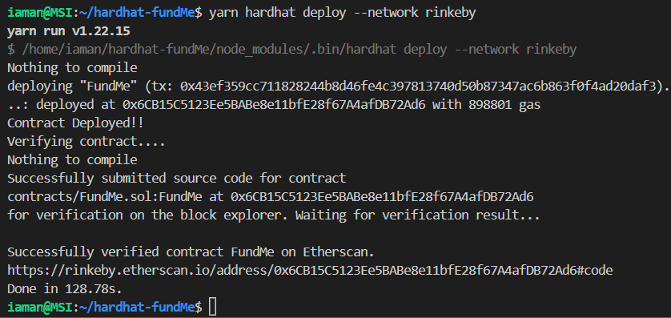

<div align="center">
  <a href="https://github.com/iamansingh0/hardhat-fundMe">
    <p align="center">
      
    </p>
  </a>
  <h3 align="center"><strong>Compile, Deploy, Publish and Test Smart Contract Using Hardhat</strong></h3>
  <hr>
</div>
<details>
  <summary>Table of Contents</summary>
  <ol>
    <li>
      <a href="#about-the-project">About The Project</a>
      <ul>
        <li><a href="#built-with">Built With</a></li>
      </ul>
    </li>
    <li>
      <a href="#getting-started">Getting Started</a>
      <ul>
        <li><a href="#prerequisites-and-installation">Prerequisites and Installation</a></li>
        <li><a href="#what-does-this-contract-do">What does this contract do</a></li>
      </ul>
    </li>
    <li><a href="#setting-up-hardhat">Setting up Hardhat</a></li>
    <li><a href="#compile-the-solidity-files">Compile the Solidity Files</a></li>
    <li><a href="#deploy-smart-contract-using-hardhat-deploy-package">Deploy Smart Contract Using Hardhat Deploy Package</a>
		<ul>
			<li><a href="#write-deploy-scripts">Write deploy scripts</a></li>
			<li><a href="#deploying-the-contract">Deploying the contract</a></li>
			<li><a href="#verify-and-publishing-the-contract">Verify and Publishing the Contract</a>
				<ul>
					<li><a href="#edit-hardhat-config-js-file">Edit hardhat config js file</a></li>
				</ul>
			</li>
		</ul>
    </li>
	<li><a href="#link-to-smart-contract">Link to smart contract</a></li>
  </ol>
</details>
<hr>

## About the project
It is a very basic project for web3 beginners on how to deploy their smart contract using [Hardhat](https://hardhat.org/getting-started). In this project, there is a smart contract called **fundMe**. By using step by step process I am compiling, deploying, publishing and testing my smart contract to a local network (``hardhat network``, `localhost`) and on a testnet(``rinkeby``).
Let's get started! 

### Built With


## Getting Started
So before getting started, I want you to make sure that while following all the steps you might get errors so don't let them stop you! Search your error in the `community` and in indexed platforms like **stackoverflow** and **stackEthExchange** etc!

### Prerequisites and Installation
As a prerequisites, you should atleast know how javascript syntaxes work. If you forget about them, I'll pinpoint some keywords that will be important in this project.
- async function()
- await
- require()
- Basic variable types and strings

You should know how to write smart contract in solidity, I guess if you are trying to deploy it than you must know solidity.

As we all know that linux environment is the best for programming and tasks, so for this project also I'll be using linux environment in your windows and macOS environemnt
So first you need to install **wsl** in your environment. It lets you work on linux environment within your local environment.
- [WSL](https://docs.microsoft.com/en-us/windows/wsl/install)

After installing wsl, set username and password. Now open vscode and download an extension called **remote development**. Open command Palette and search *open in wsl window*. It will open vs code in wsl environment. Make a folder and get started!

### What does this contract do
---
This smart contract is a simple fund collector smart contract, in this there are two functions 
1. **`fund()`** : This function collects the funds when calling with  populated [`msg.value`](https://codeforgeek.com/send-ethereum-to-message-sender-solidity/). 
It has a minimum Usd requirement value set. Anyone can run this function and fund this contract.
2. **`withdraw()`** : Only owner of this contract can call this function and withdraw all the funds to its account. 
3. **`funders`**: This is an array of address contains the address of all the funders who funded this contract.
4. **`addressToAmountFunded[funder]`** : This is a mapping (address to uint256), in this the funders addresses are saved with the amounts they funded.
5. **`constructor`** : Contructor takes one parameter, the address of chains to convert eth value to usd. [Learn More](https://docs.chain.link/docs/ethereum-addresses/)
6. **`recieve()`** : This function is only executed when someone tries to send fund without using fund() function, this function will automatically direct thee user to fund() function.
7. **`fallback()`** : This'll run in the normal condition.

## Setting up Hardhat
- Add hardhat 
```
yarn add --dev hardhat
```
- Now run `yarn hardhat` and choose advance project
- say yes to all
- Go to `.prettierrc` and edit it like this(**optional**)
```json
{
    "tabWidth": 4,
    "useTabs": false,
    "semi": false,
    "singleQuote": false
}
```
## Compile the Solidity Files

1. First delete the `Greeter.sol` file from **contracts** directory and make a new solidity file and write your smart contract code there.
> For me its fundMe.sol and priceConvertor.sol
2. Match the solidity compiler in your solidity file with `hardhat.config.js` file, if they are different then update the compiler version in `hardhat.config.js` file.
3. Adding [chainlink](https://docs.chain.link/) to out project.
```
yarn add --dev @chainlink/contracts
```
4. run `yarn hardhat compile`, and the solidity file must be compiled with the output: 
```
Downloading compiler 0.8.8
Compiled 3 Solidity file successfully
Done in 1.19s.
```

## Deploy Smart Contract Using Hardhat Deploy Package
1. Add [hardhat-deploy](https://www.npmjs.com/package/hardhat-deploy) package 
```
yarn add --dev hardhat-deploy
```
2. Import this on your **hardhat.config.js** file at the top of the file
```js
require("hardhat-deploy")
```
3. Create a new folder `deploy`, here we'll be writing our scripts
4. Add `hardhat-deploy-ether` using command 
```
yarn add --dev @nomiclabs/hardhat-ethers@npm:hardhat-deploy-ethers ethers
```

### Write deploy scripts
---
1. Create a new script file under **deploy** folder
> for me it's `01-deploy-fund-me.js`
2. Basic format:
```js
module.exports = async ({ getNamedAccounts, deployments }) => { }
```
> We are getting two objects in parameter from [hre](https://hardhat.org/advanced/hardhat-runtime-environment)!
- Here this syntax can be little confusing but what basically we are doing here is like this
```js
module.exports = async (hre){ 
	{ getNamedAccounts, deployments } = hre // 2nd line
	// above line is same as
	// hre.getNamedAccounts
	// hre.deployments
}
```
3. The 2nd line is called object destructuring in js, you can read about it here [more](https://www.javascripttutorial.net/es6/javascript-object-destructuring/)

4. We are using this **deployments** objects to get two functions, thos two functions are **deploy** and **log** and we'll get **deployer** account from getNamedAccounts() function.
5. And we'll grab our networks chainId.
```js
module.exports = async ({ getNamedAccounts, deployments }) => {
	const { deploy, log } = deployments
	const { deployer } = await  getNamedAccounts()
  const  chainId = network.config.chainId
}
```
5. getNamedAccounts(): We are pulling out **deployer** account from this function, this  function is basically used to name the different accounts availabe in a single network.
See this example:
```js
module.exports = {
	networks: {
		rinkeby: {
			url: RINKEBY_URL || "",
			accounts: [private_key1, private_key2, private_key3...],
		},
	},
	// so many accounts in a single network
	// here we can use getNamedAccounts(), so what we'll do:
	namedAccounts: {
		deployer: {
			default: 0, // the first account in the accounts list will be the default depployer
			4: 1, // let's say in rinkeby we want it to have first position
		},
		user: {
			default: 1, // for user purpose the default account will be second account in the list
		},
	}
```
> So that's how we can use this getNamedAccounts and deployer account in our hardhat config file

7. To deploy this contract we can do something like:
```js
const  fundMe = await  deploy("FundMe", {
	from:  deployer,
	args: [], //put constructor args here
	log:  true,
})
```
8. But to put address in the args, we can use of chainId. To do this, we'll make a new file in root directory -> `helper-hardhat-config.js`
9.  Paste this code there:
```js
const  networkConfig = {
	4: {
		name:  "rinkeby",
		ethUsdPriceFeed:  "0x8A753747A1Fa494EC906cE90E9f37563A8AF630e"
	},
	137: {
		name:  "polygon",
		ethUsdPriceFeed:  "0xF9680D99D6C9589e2a93a78A04A279e509205945"
	},
	42: {
		name:  "kovan",
		ethUsdPriceFeed:  "0x9326BFA02ADD2366b30bacB125260Af641031331"
	}
//31337
}
module.exports = {
	networkConfig,
}
``` 
10. Add this at the top of your script file
```js
const { networkConfig } = require("../helper-hardhat-config")
```
Add this before using deploy function in script file:
```js
const  ethUsdPriceFeedAddress = networkConfig[chainId]["ethUsdPriceFeed"]
```
11. What if we want to deploy it to a network which doesn't have this priceFeed address(like local networks), this is where [**mocking**](https://stackoverflow.com/questions/2665812/what-is-mocking#:~:text=To%20isolate%20the%20behavior%20of,the%20behavior%20of%20real%20objects.) comes into the picture.

12. **`mocking`**: If the contract doesn't exist, we deploy a minimal version of it for our local testing. And deploying mocks is basically deploying scripts.

13. In deploy folder, create a new file: `00-deploy-mocks.js`
14. Inside contracts folder, create a new folder **test** and create a new file inside it: `Mock.sol`. This is where we are going to define mock priceFeed address.

15. For our convenience, [**@chainlink/contracts**](https://github.com/smartcontractkit/chainlink/blob/develop/contracts/src/v0.6/tests/MockV3Aggregator.sol) comes with a predefined Mock for this purpose only. So in our **`Mock.sol`** file, we can import:
```js
// SPDX-License-Identifier: MIT
pragma solidity ^0.6.0
import  "@chainlink/contracts/src/v0.6/tests/MockV3Aggregator.sol"
```
16. While compiling, we'll get an error says:
```error
The Solidity version pragma statement in these files doesn't match any of the configured compilers in your config. Change the pragma or configure additional compiler versions in your hardhat config.
```
To resolve this error, we can add multiple compiler versions in out **hardhat.config.js** file:
```js
solidity: {
	compilers: [{version:  "0.8.8"}, {version:  "0.6.6"}]
},
```
17. Now run **yarn hardhat compile** and files will be compiled successully.

### Deploying the contract
---
1. Now we have this **Mock.sol** compiled, let's write code to deploy it. We don't want it to be deployed when we are deploying our FundMe contracts on a network which has priceFeed.
2. Edit **helper-hardhat-config.js**
```js
const  developmentChains = ["hardhat", "localhost"]
const  DECIMALS = 8
const  INITIAL_ANSWER = 200000000000
module.exports = {
	networkConfig,
	developmentChains,
}
```
import this **developmentChains** on **00-deploy-mock.js** script.
```js
const { developmentChains, DECIMALS, INITIAL_ANSWER } = require("../helper-hardhat-config")
```
3. **`00-deploy-mocks.js`** file:
```js
const { network } = require("hardhat")
const { developmentChains, DECIMALS, INITIAL_ANSWER } = require("../helper-hardhat-config")
module.exports = async ({ getNamedAccounts, deployments }) => {
	const { deploy, log } = deployments
	const { deployer } = await  getNamedAccounts()
	const  chainId = network.config.chainId
	if(chainId == "31337") {
		log("Local network detected! Deploying mocks...")
		await  deploy("Mock", {
			contract:  Mock,
			from:  deployer,
			log:  true,
			args: [DECIMALS, INITIAL_ANSWER]
		})
		log("Mocks deployed!")
	}
}
module.exports.tags = ["all", "mocks"]
```
4. Run this command and only the mock script will be deployed!
```shell
yarn hardhat deploy --tags mocks
```
5. Check the **01-deploy-fund-me.js** file from the codes above.
6. `yarn hardhat deploy` : deploying on hardhat local network. 
yayyyyyyyyyyy!

### Verify and Publishing the Contract
---
1. I created a new folder **utils** in root directory and under it, a file names `verify.js`.
2. In verify.js put this code
```js
const { run } = require("hardhat")

const verify = async (ContractAddress, args) => {
    console.log("Verifying contract....")
    try {
        await run("verify:verify", {
            address: ContractAddress,
            constructorArguments: args,
        })
    } catch (e) {
        if (e.message.toLowerCase().includes("already verified")) {
            console.log("Already Verified")
        } else {
            console.log(e)
        }
    }
}
module.exports = { verify }
```

3. In deploy fund me script, pull out verify from verify.js using
```js
const { verify } = require("../utils/verify")
```

4. Add this in deploy function:
```js
if(!developmentChains.includes(network.name) && process.env.ETHERSCAN_API_KEY)
    {
        await verify(fundMe.address, [ethUsdPriceFeedAddress])
    }
```

5. But first create a `.env` file and put your [ETHERSCAN_API](https://www.etherscan.io), [RINKEBY_URL](www.alchemy.com), [COINMAKERCAP_API](https://pro.coinmarketcap.com/account) and [PRIVATE_KEY](#) from your rinkeby account.
```
ETHERSCAN_API_KEY= <ETHERSCAN_API>
RINKEBY_URL=https://eth-rinkeby.alchemyapi.io/v2/<YOUR-ALCHEMY-API>
PRIVATE_KEY=<YOUR-PRIVATE-KEY>
COINMARKETAPP_KEY=<YOUR-COINMAKERCAP-API>
```

##### Edit hardhat config js file
1. First pull out all api and keys from **.env** file:
```js
const RINKEBY_RPC_URL = process.env.RINKEBY_URL || " "
const PRIVATE_KEY = process.env.PRIVATE_KEY || "key"
const ETHERSCAN_API_KEY = process.env.ETHERSCAN_API_KEY || "key"
const COINMARKETAPP_KEY = process.env.COINMARKETAPP_KEY || "api"
```

2. Now edit module.exports:
	1. Delete ropston network there and add rinkeby
	```js
	networks: {
        rinkeby: {
            url: RINKEBY_RPC_URL,
            accounts: [PRIVATE_KEY],
            chainId: 4,
            blockConfirmations: 6,
        },
    },
	```
	2. Edit gasReporter:
	```js
	gasReporter: {
        enablesd: false,
        outputFile: "gas-report.txt",
        noColors: true,
        currency: "USD",
        coinmarketcap: COINMARKETAPP_KEY,
    },
	```

	3. Edit Etherscan:
	```js
	etherscan: {
        apiKey: ETHERSCAN_API_KEY,
    },
	```
Done

6. insert this line of code in your deploy script under the `log: true` of your `await deploy` thing:
```js
waitConfirmations: network.config.blockConfirmations || 1,
```

7. Run command 
```
yarn hardhat deploy --network rinkeby
```
<p align="center">
  
</p>

## Link to smart contract
- Whoa our smart contract just got deployed and published to rinkeby etherscan

Play with it using testnet: [Link](https://rinkeby.etherscan.io/address/0x6CB15C5123Ee5BABe8e11bfE28f67A4afDB72Ad6#code)

frontend part of this project is in [this repo](https://github.com/iamansingh0/frontend-fundMe)
